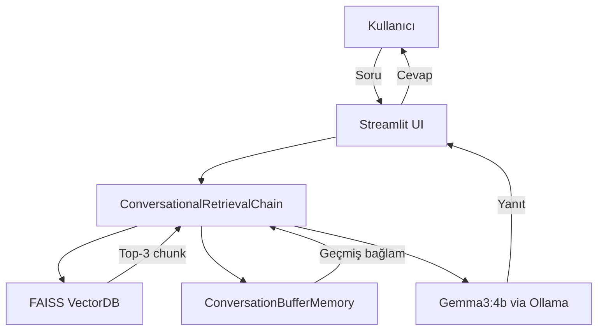
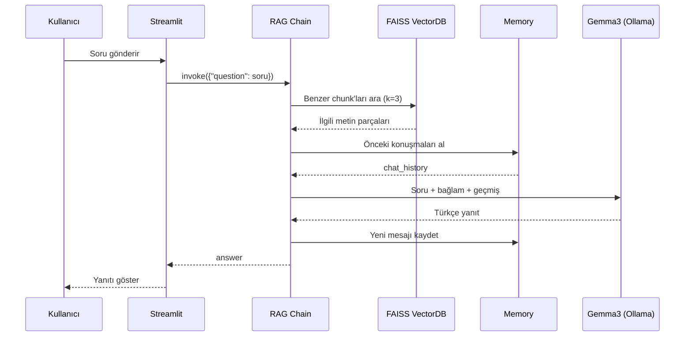

# Müşteri Destek Botu — RAG + Memory

Türkçe destekli, belgeye dayalı akıllı müşteri destek sistemi.

---

## Problem

E-ticaret müşterileri sık sık aynı soruları sorar:

> *"Şifremi unuttum", "Faturamı nereden alabilirim?", "İade süresi kaç gün?", "Yurt dışına gönderim yapıyor musunuz?"*

Her soruya insan müdahalesi pahalı ve yavaştır. Bu sistem, bu soruları **otomatik, bağlamsal ve Türkçe** olarak yanıtlar.

---

## Çözüm Yaklaşımı

```
SSS Belgesi (PDF)
      ↓
  Chunklara böl
      ↓
  LaBSE Embedding (Türkçe destekli)
      ↓
  FAISS Vektör DB'ye kaydet
      ↓
  Kullanıcı soru sorar
      ↓
  Benzer chunk'ları getir (top-k=3)
      ↓
  Gemma3 ile Türkçe yanıt üret
      ↓
  Konuşma geçmişiyle bağlam koru (Memory)
```

---

## Sistem Mimarisi





---

## Mimari Kararlar

| Karar | Seçilen | Neden |
|---|---|---|
| Embedding | LaBSE | Türkçe dahil 109 dil desteği; Türkçe metinlerde semantik benzerlik doğruluğu yüksek |
| Vektör DB | FAISS | Yerel çalışır, hızlı similarity search, dış servis bağımlılığı yok |
| LLM | Gemma3:4b (Ollama) | Tamamen local çalışır; veri gizliliği, API maliyeti yok |
| UI | Streamlit | Hızlı prototipleme; Python-native, ek frontend bilgisi gerektirmiyor |
| Chain | ConversationalRetrievalChain | RAG + memory entegrasyonunu tek API'da sağlıyor |

---

## Proje Yapısı

```
musteri_destek_botu/
├── streamlit_app.py          # Web arayüzü (kullanıcı PDF yükler)
├── chatbot_rag_memory.py     # Terminal tabanlı chatbot (geliştirme/test)
├── load_pdf_and_embedding.py # PDF → chunk → embedding → FAISS pipeline
├── musteri_destek_faq.pdf    # SSS veri seti
├── faq_vectorstore/          # Oluşturulmuş FAISS indeksi
│   ├── index.faiss
│   └── index.pkl
├── tests/
│   └── test_pipeline.py      # Chunking, FAISS oluşturma/yükleme/sorgulama testleri
├── docs/
│   └── adr/
│       ├── 001-llm-secimi.md            # Neden Ollama/Gemma3
│       ├── 002-vektor-veritabani-secimi.md  # Neden FAISS
│       └── 003-embedding-modeli-secimi.md   # Neden LaBSE
├── .streamlit/
│   └── config.toml           # Streamlit sunucu ayarları
└── requirements.txt
```

---

## Kurulum

```bash
# Sanal ortam oluştur
python -m venv venv
venv\Scripts\activate  # Windows

# Bağımlılıkları yükle
pip install langchain langchain-community langchain-ollama langchain-huggingface
pip install faiss-cpu pypdf streamlit sentence-transformers langchain-classic

# Ollama kurulu olmalı: https://ollama.com
ollama pull gemma3:4b
```

## Kullanım

```bash
# 1. Vektör DB oluştur (ilk çalıştırmada bir kez)
python load_pdf_and_embedding.py

# 2. Web arayüzü başlat
streamlit run streamlit_app.py

# veya terminal chatbot
python chatbot_rag_memory.py
```

---

## Teknoloji Stack

- **LangChain** — RAG mimarisi
- **FAISS** — Vektör veri tabanı
- **LaBSE (HuggingFace)** — Türkçe embedding
- **Gemma3:4b (Ollama)** — Local LLM
- **Streamlit** — Web arayüzü
